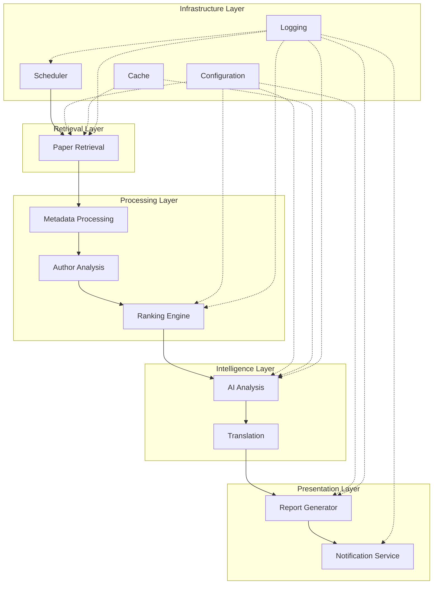

# System Architecture

## 1. Architecture Goals

### 1.1 Purpose

This document describes the software architecture of the Paper Assistant system.

It defines how the functional requirements described in Project Requirements are realized through software components, interfaces, and workflows.

This document serves as the primary architectural reference for future implementation.

---

### 1.2 Scope

The architecture covers:

- software structure
- component interactions
- internal data flow
- external interfaces
- extension mechanisms
- deployment considerations

Implementation details are intentionally omitted.

---

### 1.3 Design Objectives

The architecture is designed to achieve the following objectives:

- simplicity
- maintainability
- scalability
- extensibility
- reproducibility
- reliability

Scientific correctness shall always take precedence over implementation convenience.

---

### 1.4 Architecture Style

The system adopts a layered modular architecture.

Business logic shall remain independent of:

- external APIs
- AI providers
- storage implementation
- presentation layer

Each subsystem shall communicate through clearly defined interfaces.

---

### 1.5 Intended Audience

This document is intended for:

- software developers
- AI coding assistants
- project maintainers
- future contributors

The document assumes familiarity with Python software development.

---
## 2. High-Level Architecture

### 2.1 Architectural Overview

Paper Assistant adopts a layered modular architecture.

The architecture separates business logic from infrastructure, external services, and presentation.

Each layer has clearly defined responsibilities and communicates only through well-defined interfaces.

This separation improves:

- maintainability
- extensibility
- testability
- portability

---

### 2.2 Layered Architecture

The application consists of five primary layers:

1. Retrieval Layer
2. Processing Layer
3. Intelligence Layer
4. Presentation Layer
5. Infrastructure Layer

Each layer exposes services to the layer above while depending only on lower-level abstractions whenever practical.

---

### 2.3 Layer Responsibilities

Retrieval Layer

Responsible for collecting scientific literature and external metadata.

Examples:

- arXiv
- INSPIRE
- future literature providers

---

Processing Layer

Responsible for transforming raw data into structured internal objects.

Examples:

- metadata normalization
- author processing
- citation analysis
- ranking

---

Intelligence Layer

Responsible for AI-assisted processing.

Examples:

- summarization
- translation
- recommendation generation
- scientific analysis

---

Presentation Layer

Responsible for producing user-visible outputs.

Examples:

- HTML reports
- PDF reports
- email notifications

---

Infrastructure Layer

Responsible for supporting services.

Examples:

- configuration
- logging
- caching
- scheduling
- persistence

Business logic shall not depend directly on infrastructure implementations.

---
### 2.4 System Overview

---
### 2.5 Architectural Characteristics

The architecture emphasizes:

- clear separation of responsibilities
- deterministic processing
- reproducibility
- modular implementation
- interface-driven communication
- configuration-driven behavior

No subsystem shall rely on implementation details of unrelated modules.

---

### 2.6 Dependency Direction

Dependencies shall always flow downward through the architecture.

Higher-level modules may depend on lower-level services.

Lower-level modules shall never depend on higher-level business logic.

Circular dependencies are prohibited.

---

### 2.7 External Services

External services are treated as replaceable infrastructure components.

Examples include:

- arXiv
- INSPIRE
- OpenAI
- future AI providers
- SMTP servers

Business logic shall interact with external services only through internal interfaces.

---

### 2.8 Extensibility

Major architectural components shall support future extension through interchangeable implementations.

Examples include:

- AI providers
- translation providers
- notification providers
- report generators
- literature providers

Extensions shall minimize modification of existing source code.

---

### 2.9 Architectural Principles

The architecture follows the following principles:

- Single Responsibility Principle
- Separation of Concerns
- Dependency Inversion
- Interface-Based Design
- Configuration over Hardcoding
- Composition over Inheritance
- Explicit Data Flow
- Reproducibility by Design

Architectural decisions should be evaluated against these principles before implementation.

---

## 3. Design Principles

### 3.1 Purpose

The design principles described in this chapter define the architectural rules that guide implementation decisions throughout the project.

These principles shall remain stable even as individual implementations evolve.

Architectural consistency shall take precedence over implementation convenience.

---

### 3.2 Layered Architecture

The application adopts a layered architecture.

Each layer shall have clearly defined responsibilities.

Communication between layers shall occur only through well-defined interfaces.

Higher layers may depend on lower-layer abstractions.

Lower layers shall never depend on higher-level business logic.

---

### 3.3 Separation of Concerns

Each subsystem shall focus on a single primary responsibility.

Examples include:

- paper retrieval
- metadata processing
- author analysis
- AI processing
- report generation
- notification delivery

Responsibilities shall not overlap unnecessarily.

---

### 3.4 Single Responsibility Principle

Each module, class, and function shall have one primary reason to change.

Independent concerns shall remain isolated.

Complex functionality shall be decomposed into smaller components whenever practical.

---

### 3.5 Interface-Based Design

Subsystems shall communicate through stable interfaces rather than implementation details.

Interfaces shall remain independent of specific providers.

Examples include:

- AI providers
- translation providers
- literature providers
- notification providers

Implementation details shall remain replaceable.

---

### 3.6 Dependency Inversion

Business logic shall depend on abstractions rather than concrete implementations.

Infrastructure components shall implement interfaces defined by the application.

Business rules shall remain independent of external technologies.

---

### 3.7 Composition over Inheritance

Composition should be preferred over inheritance whenever practical.

Reusable functionality should be assembled through collaborating components rather than deep inheritance hierarchies.

---

### 3.8 Configuration over Hardcoding

Application behavior shall be controlled through configuration whenever practical.

Business rules shall avoid hardcoded values.

Examples include:

- monitored categories
- AI models
- ranking thresholds
- report options

Configuration changes shall not require source code modifications.

---

### 3.9 Explicit Data Flow

Data movement throughout the application shall remain explicit.

Hidden dependencies and implicit state sharing shall be avoided.

Each processing stage shall clearly define:

- inputs
- outputs
- side effects

---

### 3.10 Reproducibility by Design

Architectural decisions shall support scientific reproducibility.

Given identical:

- configuration
- input data
- software version

the application should produce equivalent outputs whenever practical.

---

### 3.11 Deterministic Processing

Business logic should remain deterministic whenever practical.

Non-deterministic behavior shall be isolated.

Examples include:

- AI generation
- network communication

Deterministic components shall produce identical results for identical inputs.

---

### 3.12 Loose Coupling

Dependencies between modules shall remain minimal.

Changes in one subsystem should not require widespread modifications elsewhere.

Subsystems shall communicate through documented interfaces.

---

### 3.13 High Cohesion

Related functionality shall remain grouped within the same subsystem.

Unrelated responsibilities shall not be combined.

Each module shall have a clearly defined functional boundary.

---

### 3.14 Fail Gracefully

Recoverable failures shall not unnecessarily terminate the application.

Whenever practical,

processing shall continue using degraded functionality.

Failure handling shall remain explicit.

---

### 3.15 Extensibility

Future functionality shall primarily be added through extension rather than modification.

New providers shall integrate by implementing existing interfaces whenever practical.

---

### 3.16 Architectural Decision Rules

When multiple implementation approaches are available,

the preferred solution should satisfy the greatest number of the following criteria:

- simplicity
- readability
- maintainability
- testability
- reproducibility
- extensibility
- deterministic behavior

Implementation convenience alone shall not determine architectural decisions.

---

### 3.17 Long-Term Evolution

Architectural decisions should prioritize long-term project evolution over short-term implementation speed.

Temporary implementation shortcuts shall not become permanent architectural dependencies.

The architecture shall remain suitable for continued development over multiple years.

---

## 4. Core Components

### 4.1 Overview

The Paper Assistant architecture is organized into five primary component groups.

Each component has a clearly defined responsibility and communicates with other components through documented interfaces.

The five component groups are:

- Retrieval Layer
- Processing Layer
- Intelligence Layer
- Presentation Layer
- Infrastructure Layer

Each layer is described in the following sections.

---

## 4.1 Retrieval Layer

### 4.1.1 Purpose

The Retrieval Layer is responsible for obtaining scientific literature and related metadata from external providers.

This layer isolates all external data acquisition from the remainder of the application.

---

### 4.1.2 Responsibilities

Responsibilities include:

- retrieving recent papers
- querying external metadata
- obtaining author information
- validating provider responses
- converting external data into internal domain objects

Business logic shall not exist within the Retrieval Layer.

---

### 4.1.3 Supported Providers

Initial providers include:

- arXiv
- INSPIRE

Future providers may include:

- OpenAlex
- Semantic Scholar
- Crossref

Provider additions shall not require modification of existing business logic.

---

### 4.1.4 Output

The Retrieval Layer shall produce normalized domain objects.

Provider-specific response formats shall not propagate beyond this layer.

---

### 4.1.5 Error Handling

Temporary provider failures shall remain isolated.

Errors shall be reported through standardized exceptions and logging.

Recoverable failures should not terminate the complete processing pipeline.

---

### 4.1.6 Provider Abstraction

Every literature provider shall implement a common provider interface.

Business logic shall never distinguish providers based on implementation details.

The provider interface shall define operations including:

- retrieve papers
- retrieve metadata
- retrieve authors

Future providers shall integrate by implementing the same interface.

---

### 4.2 Component Communication

Components shall communicate only through public interfaces.

Internal implementation details shall remain private to each component.

Communication between components shall primarily occur through structured domain objects rather than raw dictionaries or provider-specific responses.

---

## 4.2 Processing Layer

### 4.2.1 Purpose

The Processing Layer is responsible for transforming normalized scientific data into structured information suitable for downstream analysis.

This layer contains the core business logic of the application.

Processing components shall remain independent of external providers and infrastructure services.

---

### 4.2.2 Responsibilities

Responsibilities include:

- metadata normalization
- author analysis
- citation aggregation
- ranking calculation
- paper filtering
- scientific feature extraction

Business rules shall be implemented exclusively within this layer.

---

### 4.2.3 Processing Pipeline

The Processing Layer shall execute the following logical stages:

1. Metadata Processing
2. Author Analysis
3. Citation Aggregation
4. Ranking
5. Candidate Selection

Each stage shall consume structured domain objects and produce structured domain objects.

---

### 4.2.4 Data Validation

Incoming data shall be validated before processing.

Validation shall detect:

- missing required fields
- invalid values
- malformed metadata
- inconsistent author information

Invalid records shall be reported without interrupting unrelated processing.

---

### 4.2.5 Deterministic Processing

Given identical input data and configuration,

the Processing Layer shall produce identical output.

Business rules shall avoid unnecessary randomness.

---

### 4.2.6 Metadata Processor

The Metadata Processor is responsible for normalizing literature metadata into the project's internal representation.

Responsibilities include:

- title normalization
- abstract normalization
- author normalization
- category normalization
- publication date parsing

Provider-specific metadata formats shall not propagate beyond this component.

---

### 4.2.7 Author Analyzer

The Author Analyzer evaluates the scientific influence of paper authors.

Responsibilities include:

- citation aggregation
- author statistics
- collaboration analysis
- institution extraction
- author feature generation

Author analysis shall produce structured author profiles for downstream ranking.

---

### 4.2.8 Citation Aggregator

Citation information shall be consolidated into normalized citation statistics.

Aggregation responsibilities include:

- maximum citation count
- average citation count
- citation distribution
- citation completeness

Citation aggregation shall remain independent of ranking strategy.

---

### 4.2.9 Ranking Engine

The Ranking Engine evaluates candidate papers according to configurable ranking strategies.

Ranking shall operate exclusively on normalized domain objects.

Ranking responsibilities include:

- score calculation
- paper prioritization
- configurable weighting
- threshold evaluation
- candidate selection

Ranking algorithms shall remain independent of AI providers.

Multiple ranking strategies may coexist.

The selected strategy shall be determined through configuration.
---
### 4.2.10 Candidate Selector

The Candidate Selector determines which papers proceed to AI analysis.

Selection decisions shall consider:

- ranking score
- configurable thresholds
- maximum report size
- diversity considerations

Selection criteria shall remain configurable.

The selector shall produce a deterministic ordered candidate list.

---

### 4.2.11 Processing Principles

Processing components shall satisfy the following principles:

- deterministic behavior
- explicit inputs
- explicit outputs
- minimal side effects
- reproducible calculations
- interface-driven implementation

Processing components shall not perform:

- network communication
- AI requests
- report generation
- email delivery

Such responsibilities belong to other architectural layers.

---

### 4.2.12 Feature Extraction

The Processing Layer shall generate reusable scientific features describing each paper.

Examples include:

- citation features
- author features
- collaboration features
- category features
- publication features

Feature extraction shall remain independent of downstream consumers.

Generated features may be reused by:

- ranking
- AI prompting
- report generation
- future machine learning modules

---

### 4.3 Dependency Rules

Components shall depend only on documented interfaces.

No component shall directly manipulate the internal state of another component.

Cross-layer dependencies shall remain minimal.

Circular dependencies are prohibited.

---
## 4.3 Intelligence Layer

### 4.3.1 Purpose

The Intelligence Layer is responsible for generating AI-assisted scientific analysis from structured paper information.

This layer isolates all interactions with large language models and other intelligent services.

Business logic shall remain independent of specific AI providers.

---

### 4.3.2 Responsibilities

Responsibilities include:

- prompt generation
- AI analysis
- scientific summarization
- recommendation generation
- translation
- response validation

The Intelligence Layer shall consume structured domain objects and produce structured analysis results.

---

### 4.3.3 Architectural Objectives

The Intelligence Layer shall provide:

- provider independence
- reproducibility
- configurable prompting
- deterministic workflow
- reusable analysis results

Provider-specific implementation details shall remain isolated.

---

### 4.3.4 AI Provider Interface

All AI providers shall implement a common provider interface.

Examples include:

- OpenAI
- Google Gemini
- Anthropic Claude

The provider interface shall define operations including:

- generate analysis
- estimate usage
- validate response

Business logic shall never invoke provider-specific SDKs directly.

---

### 4.3.5 Prompt Engine

The Prompt Engine is responsible for constructing prompts for AI providers.

Responsibilities include:

- prompt templates
- prompt versioning
- scientific context
- feature insertion
- configuration expansion

Prompt generation shall remain deterministic.

Prompt construction shall be independent of AI providers.

---

### 4.3.6 Analysis Engine

The Analysis Engine coordinates AI-assisted scientific analysis.

Responsibilities include:

- provider selection
- request preparation
- response validation
- structured output generation

The Analysis Engine shall not contain provider-specific implementation details.

---

### 4.3.7 Translation Engine

The Translation Engine is responsible for generating translated scientific content.

Translation responsibilities include:

- abstract translation
- AI summary translation
- glossary application
- terminology consistency

Translation shall remain independent of report generation.

---

### 4.3.8 Response Validator

AI responses shall be validated before entering downstream processing.

Validation responsibilities include:

- required sections
- response completeness
- structured formatting
- missing content detection

Invalid responses shall trigger configurable recovery behavior.

---

### 4.3.9 AI Cache

The Intelligence Layer shall support reusable AI analysis through cache.

Cache reuse shall consider:

- prompt version
- model
- configuration
- paper identifier

Cache behavior shall remain transparent to downstream components.

---

### 4.3.10 Model Selection

Model selection shall be configuration-driven.

Different models may be assigned to different analysis tasks.

Changing models shall not require source code modifications.

---

### 4.3.11 Prompt Versioning

Every generated analysis shall record:

- prompt version
- model
- provider
- generation timestamp

Prompt evolution shall remain reproducible.

Historical prompt versions shall remain identifiable.

---

### 4.3.12 Intelligence Workflow

The Intelligence Layer shall execute the following workflow:

1. Receive structured paper information
2. Select prompt template
3. Generate prompt
4. Select AI provider
5. Execute AI request
6. Validate response
7. Translate content (optional)
8. Store cache
9. Return structured analysis

---

### 4.3.13 Structured AI Output

The Intelligence Layer shall produce structured analysis objects rather than free-form text.

Analysis objects may include:

- scientific summary
- contribution
- methodology
- strengths
- limitations
- recommendation
- translated summary

Downstream components shall consume structured objects instead of parsing raw AI responses.

---

### 4.4 Component Lifecycle

Each component shall follow the same lifecycle:

1. Receive validated input
2. Perform a single well-defined responsibility
3. Produce structured output
4. Report execution status
5. Return control to the pipeline

Components shall not perform unrelated responsibilities.

---
## 4.4 Presentation Layer

### 4.4.1 Purpose

The Presentation Layer is responsible for transforming structured analysis results into user-facing outputs.

Presentation components shall not contain business logic.

The Presentation Layer consumes structured domain objects and produces presentation artifacts.

---

### 4.4.2 Responsibilities

Responsibilities include:

- report generation
- HTML rendering
- email formatting
- notification preparation
- export generation

Presentation decisions shall remain independent of business logic.

---

### 4.4.3 Architectural Objectives

The Presentation Layer shall provide:

- presentation independence
- reusable templates
- configurable layouts
- multiple output formats
- separation between content and rendering

Presentation components shall not access external providers directly.

---

### 4.4.4 Input

Presentation components shall consume structured domain objects.

Examples include:

- Paper
- AuthorProfile
- AnalysisResult
- ReportModel

Raw AI responses shall never enter the Presentation Layer.

---
### 4.4.5 Report Generator

The Report Generator is responsible for assembling complete reports.

Responsibilities include:

- report structure
- section ordering
- metadata insertion
- statistics generation
- reference generation

The Report Generator shall remain independent of rendering technologies.

---
### 4.4.6 Renderer

The Renderer converts report models into presentation formats.

Supported renderers may include:

- HTML
- Markdown
- PDF
- JSON

Each renderer shall consume the same report model.

Rendering implementations shall remain interchangeable.

---

### 4.4.7 Template Engine

Presentation templates shall define visual appearance independently from report generation.

Template responsibilities include:

- page layout
- typography
- section styling
- color themes

Templates shall not contain business logic.

---

### 4.4.8 Notification Service

The Notification Service is responsible for delivering generated reports.

Supported notification mechanisms may include:

- email
- Slack
- Microsoft Teams
- Telegram
- WeChat

Notification providers shall implement a common interface.

---

### 4.4.9 Export Service

The Export Service is responsible for producing downloadable report artifacts.

Supported export formats may include:

- HTML
- PDF
- Markdown
- JSON

Export implementations shall reuse the same report model.

---

### 4.4.10 Presentation Workflow

The Presentation Layer shall execute the following workflow:

1. Receive ReportModel
2. Select template
3. Generate presentation model
4. Render output
5. Export artifacts
6. Deliver notifications

Presentation workflow shall remain deterministic.

---

### 4.4.11 Presentation Principles

Presentation components shall satisfy the following principles:

- no business logic
- reusable templates
- deterministic rendering
- configurable appearance
- renderer independence
- notification independence

Presentation components shall remain independent of AI providers.

---

### 4.4.12 Report Model

The Presentation Layer shall operate on a structured ReportModel.

The ReportModel shall represent the complete report independently of any output format.

The ReportModel may include:

- execution metadata
- report summary
- selected papers
- AI analyses
- statistics
- references

Renderers shall consume the ReportModel directly.

Future report formats shall reuse the same ReportModel without modification.

---

## 4.5 Infrastructure Layer

### 4.5.1 Purpose

The Infrastructure Layer provides shared services required by the application.

Infrastructure components shall support business logic without containing business rules.

Business components shall remain independent of infrastructure implementations whenever practical.

---

### 4.5.2 Responsibilities

Responsibilities include:

- configuration management
- logging
- caching
- scheduling
- persistence
- dependency management

Infrastructure services shall be reusable throughout the application.

---

### 4.5.3 Architectural Objectives

The Infrastructure Layer shall provide:

- reliability
- portability
- configurability
- observability
- replaceable implementations

Infrastructure components shall expose stable interfaces.

---

### 4.5.4 Design Principles

Infrastructure shall remain isolated from business logic.

Infrastructure implementations may evolve without affecting application behavior.

Business modules shall communicate through infrastructure interfaces rather than concrete implementations.

---

### 4.5.5 Configuration Manager

The Configuration Manager is responsible for loading and validating application configuration.

Responsibilities include:

- configuration loading
- schema validation
- default values
- environment variable expansion
- configuration version tracking

Configuration shall be immutable during pipeline execution unless explicitly reloaded.

---

### 4.5.6 Logging Manager

The Logging Manager provides centralized logging services.

Responsibilities include:

- structured logging
- log formatting
- log persistence
- execution tracing
- error reporting

Logging shall remain independent of business logic.

---

### 4.5.7 Cache Manager

The Cache Manager coordinates reusable cached objects.

Responsibilities include:

- cache lookup
- cache storage
- expiration
- invalidation
- cache statistics

Cache implementations shall remain replaceable.

---

### 4.5.8 Scheduler

The Scheduler coordinates automatic application execution.

Responsibilities include:

- execution scheduling
- retry management
- execution locking
- execution history

Scheduling implementation shall remain independent of operating system details.

---

### 4.5.9 Storage Manager

The Storage Manager provides persistent storage services.

Responsibilities include:

- report storage
- cache storage
- execution history
- metadata persistence

Storage implementations shall remain interchangeable.

---

### 4.5.10 Service Container

The application shall initialize shared services through a centralized service container.

Shared services may include:

- configuration
- logging
- cache
- scheduler
- provider registry

Business components shall obtain shared services through dependency injection rather than global state.

---

### 4.5.11 Provider Registry

The Provider Registry maintains available provider implementations.

Provider categories may include:

- literature providers
- AI providers
- translation providers
- notification providers

Provider selection shall be configuration-driven.

---

### 4.5.12 Lifecycle Manager

The Lifecycle Manager coordinates application startup and shutdown.

Startup responsibilities include:

- configuration validation
- service initialization
- provider registration

Shutdown responsibilities include:

- resource cleanup
- cache persistence
- log flushing

Lifecycle management shall ensure orderly application execution.

---

### 4.5.13 Infrastructure Principles

Infrastructure components shall satisfy the following principles:

- shared services
- replaceable implementations
- minimal coupling
- explicit interfaces
- deterministic initialization
- graceful shutdown

Infrastructure components shall not implement business rules.

---

### 4.5.14 Dependency Injection

Application components shall receive required services through dependency injection.

Components shall avoid:

- global variables
- singleton business objects
- hidden service locators

Dependency injection shall improve:

- testability
- modularity
- provider replacement
- maintainability

The composition root shall be responsible for constructing the application object graph.

---